# Stick-Gen

 **Stick-Gen** is a dual-phase generative model for creating realistic stick figure animations from text prompts. It combines an autoregressive transformer for motion planning with a diffusion refinement module for high-fidelity smoothing.

## Features

### Core Capabilities
- **Dual-Phase Architecture**: Transformer (Motion Planning) + Diffusion (Refinement).
- **Advanced Training**: PEFT/LoRA support and physics-consistency loss functions.
- **Data Engine**: Converters for AMASS, HumanML3D, KIT-ML, BABEL, BEAT, NTU-RGB+D, 100STYLE, and curation tools.
- **Evaluation**: Comprehensive metrics suite (FID, Diversity, Physics Score, Artifact Detection, Smoothness).
- **High-Performance Rendering**: Decoupled `.motion` export for 60fps WebGL/Three.js rendering.
- **Production Ready**: 7M-45M parameter variants, optimized for CPU/runpod inference.
- **10-Second Sequences**: Extended animations with 250 frames @ 25fps.
- **Motion Capture Integration**: AMASS, InterHuman, KIT-ML, BABEL, BEAT, NTU-RGB+D, 100STYLE, and more.

### Motion Quality
- **Physics-Aware Motion**: Velocity, acceleration, and momentum tracking for realistic dynamics
- **Realistic Spatial Movement**: Actors move through space with real-world velocities
- **Temporal Consistency**: Smooth frame-to-frame transitions
- **42 Actions**: Walk, run, jump, throw, catch, kick, dance, and more
- **25+ Objects**: Realistic object scales and interactions

### Facial Expressions 
- **6 Expression Types**: NEUTRAL, HAPPY, SAD, SURPRISED, ANGRY, EXCITED
- **Smooth Transitions**: 0.3-second interpolated transitions between expressions
- **Action-Driven**: Automatic expression assignment based on action context
- **Minimalist Design**: Emoji-style faces that maintain stick figure aesthetic

### Speech Animation 
- **4 Speech Types**: TALK, SHOUT, WHISPER, SING
- **Cyclic Mouth Movements**: Frequency-based animation (4-10 Hz)
- **Synchronized**: Mouth movements sync with speech actions

### Cinematic Rendering (2.5D)
- **Perspective Projection**: Weak perspective with focal length simulation
- **Z-Depth Ordering**: Painter's algorithm for proper limb occlusion
- **Dynamic Line Width**: Depth-based stroke thickness
- **CinematicRenderer**: Enhanced renderer with 3D-like effects

### Camera System
- **6 Movement Types**: Static, Pan, Zoom, Track, Dolly, Crane, Orbit
- **CameraKeyframe**: Per-frame camera state with smooth interpolation
- **Camera Conditioning**: Model accepts camera context during generation
- **Cinematic Direction**: Create dynamic camera movements for storytelling

### LLM Story Generation
- **Multiple Backends**: Grok (X.AI), Ollama (local), Mock (testing)
- **ScriptSchema**: Structured JSON format for complex narratives
- **Script-to-Scene**: Convert LLM scripts to renderable scenes
- **Action Mapping**: Automatic action assignment from story context

### 100STYLE Dataset Support
- **BVH Forward Kinematics**: Full skeleton-to-stick-figure conversion
- **100+ Motion Styles**: Depressed, Angry, Happy, Proud, and more
- **Automatic Resampling**: Convert any FPS to target frame rate
- **Joint Mapping**: Standard CMU/Mixamo skeleton retargeting

### Training Features
- **Data Augmentation**: 4x augmentation (speed, position, scale, mirror)
- **Multi-Task Learning**: 6 decoder heads (pose, position, velocity, action, physics, environment)
- **Action Conditioning**: Per-frame action labels enable context-aware generation
- **Configurable**: YAML-based configuration for different hardware setups
- **Checkpoint Resume**: Continue training from checkpoints (CLI, env var, or config)
- **SFT/LoRA Support**: Supervised fine-tuning and LoRA adapters for efficient training
- **Safety Critic**: Robustness evaluation with adversarial prompt suites

## How It Works

Stick-Gen uses a multi-stage pipeline to generate animations from text:

1. **Text Encoding**: Input text is encoded using BAAI/bge-large-en-v1.5 to create a 1024-dimensional semantic embedding
2. **Transformer Processing**: The embedding is fed into a transformer (6-10 layers depending on variant) that learns to map text semantics to motion patterns
3. **Multi-Task Decoding**: Six specialized decoder heads predict different aspects of motion:
   - **Pose**: Joint positions for stick figure skeleton
   - **Position**: Global position in 2D space
   - **Velocity**: Movement speed and direction
   - **Actions**: Per-frame action labels (walk, run, jump, etc.)
   - **Physics**: Velocity, acceleration, and momentum
   - **Environment**: Interaction with objects and other characters
4. **Expression & Speech**: Facial expressions and mouth movements are added based on action context
5. **Rendering**: The complete motion sequence is rendered to video with smooth interpolation

### Example Pipeline


## Quick Start

### Generate Animation
```bash
./stick-gen "Two teams playing against each other in a World Series playoff"
./stick-gen "A man exploring space and meets an alien" --output space.mp4
```

### Examples
- **Baseball**: Players run around bases with realistic movement
- **Space Exploration**: Characters walk from spaceship to aliens
- **Soccer**: Players kick ball and run across field
- **Narrative**: Characters interact with realistic spatial positioning

### 2.5D Parallax Augmentation (Offline Training Data)

You can turn canonical `.pt` motion datasets into multi-view 2.5D PNGs plus metadata with:

```bash
stick-gen generate-data \
  --config configs/medium.yaml \
  --augment-parallax \
  --views-per-motion 250 \
  --frames-per-view 4 \
  --output data/2.5d_parallax
```

This writes, for each `(sample, actor)` pair:

- `data/2.5d_parallax/sample_XXXXXX/actor_Y/*.png`
- `data/2.5d_parallax/sample_XXXXXX/actor_Y/metadata.json` describing:
  - `sample_id`, `actor_id`
  - `view_id` and per-frame `motion_frame_index`
  - camera pose (`position`, `target`, `fov`)

For multimodal training, use `src/train/parallax_dataset.py::MultimodalParallaxDataset`
with your training `.pt` file (see `data.*` paths in the configs).

#### Parallax Pipeline Architecture

```mermaid
flowchart TB
    subgraph INPUT["📁 INPUT"]
        PT["train_data.pt<br/>(canonical motion)"]
    end

    subgraph EXPORT["📤 MOTION EXPORT"]
        ACTOR["Per-Actor Extraction"]
        MOTION[".motion JSON files"]
    end

    subgraph RENDER["🎬 THREE.JS RENDERER"]
        NODE["Node.js Runtime"]
        THREE["three.js + headless-gl"]
        CAMERA["Camera Trajectories<br/>(250 views × 4 frames)"]
    end

    subgraph OUTPUT["📦 OUTPUT"]
        PNG["PNG Frames<br/>(per sample/actor)"]
        META["metadata.json<br/>(view_id, camera pose)"]
    end

    subgraph TRAINING["🧠 TRAINING"]
        DATASET["MultimodalParallaxDataset"]
        LOADER["DataLoader"]
        MODEL["Transformer + Image Encoder"]
    end

    PT --> ACTOR
    ACTOR --> MOTION
    MOTION --> NODE
    NODE --> THREE
    THREE --> CAMERA
    CAMERA --> PNG
    CAMERA --> META
    PNG --> DATASET
    META --> DATASET
    PT --> DATASET
    DATASET --> LOADER
    LOADER --> MODEL
```



**Requirements:**
- Node.js 18+ with npm packages: `three`, `pngjs`, `gl` (headless-gl)
- System packages: `libxi-dev`, `libgl1-mesa-dev`, `libglew-dev`, `xvfb`
- See `docker/Dockerfile` for complete setup

## Architecture

### System Overview


### Transformer Layer (RMSNorm + RoPE + SwiGLU)

```mermaid
flowchart LR
    X0["x₀ (d_model)"] --> N1["RMSNorm"]
    N1 --> ATT["Multi-Head Self-Attention<br/>+ RoPE(q, k)"]
    ATT --> ADD1["x₁ = x₀ + Attention(RMSNorm(x₀))"]
    ADD1 --> N2["RMSNorm"]
    N2 --> GATE["W_gate · x₁"]
    N2 --> VALUE["W_value · x₁"]
    GATE --> SILU["SiLU"]
    SILU --> MUL["⊙ (element-wise)"]
    VALUE --> MUL
    MUL --> PROJ_OUT["W_out · (...)"]
    PROJ_OUT --> ADD2["x₂ = x₁ + SwiGLU(RMSNorm(x₁))"]
```



### Full System Architecture & Workflows

```mermaid
%%{init: {'theme': 'base', 'themeVariables': { 'primaryColor': '#4F46E5', 'primaryTextColor': '#fff', 'primaryBorderColor': '#312E81', 'lineColor': '#6366F1', 'secondaryColor': '#10B981', 'tertiaryColor': '#F59E0B', 'background': '#F8FAFC'}}}%%

flowchart TB
    subgraph INPUT["📝 INPUT LAYER"]
        direction LR
        TEXT["💬 Text Prompt<br/><i>'Two dancers performing'</i>"]
        LLM_OPT["🤖 LLM Story Engine<br/><b>Optional</b><br/>Grok | Ollama | Mock"]
        SCRIPT["📄 Script Schema<br/>Characters, Actions,<br/>Duration, Camera"]
    end

    subgraph EMBED["🧠 EMBEDDING LAYER"]
        direction LR
        BGE["🔥 BAAI/bge-large-en-v1.5<br/><b>Top-5 MTEB</b><br/>1024-dim vectors"]
        EMB_CACHE["💾 Embedding Cache<br/><i>Precomputed for training</i>"]
    end

    subgraph MODEL["⚡ TRANSFORMER CORE"]
        direction TB
        
        subgraph VARIANTS["Model Variants"]
            SMALL["🔹 Small<br/>7.2M / 11.7M params<br/>d=256, L=6, H=8<br/><i>CPU-friendly</i>"]
            MEDIUM["🔸 Medium<br/>20.6M / 25.1M params<br/>d=384, L=8, H=12<br/><i>Recommended</i>"]
            LARGE["🔺 Large<br/>44.6M / 71.3M params<br/>d=512, L=10, H=16<br/><i>Max quality</i>"]
        end
        
        subgraph CONDITIONING["Conditioning"]
            TEXT_COND["📝 Text Conditioning<br/>Projected 1024→d_model"]
            ACTION_COND["🎬 Action Conditioning<br/>Per-frame action labels (60 classes)"]
            CAMERA_COND["📷 Camera Conditioning<br/>Camera state (x, y, zoom)"]
        end
        
        TRANSFORMER["Repeat x Layers:<br/><b>RoPE Attention</b><br/><b>SwiGLU FFN</b><br/><b>RMSNorm</b> (Pre-Norm)"]
        LORA_MOD["🧩 LoRA Adapters<br/>(Optional)"]
    end

    subgraph HEADS["🎯 MULTI-TASK DECODER HEADS"]
        direction LR
        H1["🦴 Pose<br/>20-dim joints<br/>5 segments × 4 coords"]
        H2["📍 Position<br/>2-dim global<br/>XY coordinates"]
        H3["➡️ Velocity<br/>2-dim movement<br/>direction & speed"]
        H4["🏷️ Actions<br/>60 classes<br/>walk, run, jump..."]
        H5["⚛️ Physics<br/>6-dim state<br/>vx, vy, ax, ay, momentum"]
        H6["🌍 Environment<br/>32-dim context<br/>ground, obstacles"]
    end
    
    subgraph REFINEMENT["✨ PHASE 2: DIFFUSION REFINEMENT"]
        direction TB
        DIFF_NET["🌊 Diffusion UNet<br/>Denoising refinement"]
        DIFF_SCHED["Scheduler<br/>DDPM / DDIM"]
    end

    subgraph MOTION["🎭 MOTION PROCESSING"]
        direction TB
        SEQ["🎞️ Motion Sequence<br/>250 frames @ 25fps<br/>10-second duration"]
        
        subgraph EXPRESSIONS["Facial Expressions"]
            EXP_TYPES["😊 6 Expression Types<br/>NEUTRAL | HAPPY | SAD<br/>SURPRISED | ANGRY | EXCITED"]
            MOUTH["👄 Speech Animation<br/>TALK | SHOUT<br/>WHISPER | SING"]
            TRANS["✨ Smooth Transitions<br/>0.3s interpolation"]
        end
        
        PHYSICS_JA["⚡ Brax Physics<br/>Differentiable Loss<br/>(JAX dependent)"]
    end

    subgraph CAMERA["🎹 CAMERA SYSTEM"]
        direction LR
        CAM_STATIC["📌 Static"]
        CAM_PAN["↔️ Pan"]
        CAM_ZOOM["🔍 Zoom"]
        CAM_TRACK["🎯 Track"]
        CAM_DOLLY["🚃 Dolly"]
        CAM_CRANE["🏗️ Crane"]
        CAM_ORBIT["🔄 Orbit"]
    end

    subgraph RENDER["🎨 RENDERING ENGINE"]
        direction TB
        
        subgraph STYLES["Render Styles"]
            STY_NORMAL["✏️ Normal"]
            STY_SKETCH["📝 Sketch"]
            STY_INK["🖋️ Ink"]
            STY_NEON["💡 Neon"]
        end
        
        EXPORTER["📦 Motion Exporter<br/>.motion JSON Output<br/>(Web/Three.js Ready)"]
        
        subgraph CINEMATIC["2.5D Cinematic"]
            PERSP["🎭 Perspective<br/>Weak perspective<br/>focal length"]
            ZDEPTH["📊 Z-Depth<br/>Painter's algorithm<br/>limb occlusion"]
            LINEWIDTH["📏 Dynamic Lines<br/>Depth-based<br/>stroke thickness"]
        end
        
        RENDERER["🖼️ Frame Renderer<br/>Matplotlib + Cairo"]
    end

    subgraph OUTPUT["📤 OUTPUT LAYER"]
        direction LR
        MP4["🎬 MP4 Video"]
        GIF["🎞️ GIF Animation"]
        FRAMES["🖼️ Frame Sequence"]
    end

    subgraph TRAINING["🏋️ TRAINING PIPELINE"]
        direction TB
        
        subgraph DATA_SOURCES["📊 Data Sources"]
            SYNTH["🔧 Synthetic<br/>10k-100k samples<br/>4× augmentation"]
            AMASS["🏃 AMASS<br/>~17k sequences<br/>SMPL+H"]
            INTER["👥 InterHuman<br/>~6k sequences<br/>Multi-person"]
            NTU["🎥 NTU-RGB+D<br/>~56k skeletons"]
            STYLE100["💃 100STYLE<br/>~4k clips<br/>BVH format"]
            KIT["📝 KIT-ML<br/>~4k texts<br/>HumanML processed"]
            BABEL["🏷️ BABEL<br/>AMASS Labels"]
            BEAT["🗣️ BEAT<br/>Speech-Gesture"]
        end
        
        subgraph PIPELINE["Training Phases"]
            P1["1️⃣ Data Generation"]
            P2["2️⃣ MoCap Conversion"]
            P2b["2b️⃣ Dataset Merge<br/>Source Balancing"]
            P3["3️⃣ Embedding Gen"]
            P4["4️⃣ Curation<br/>Quality Filtering"]
            P5["5️⃣ Pretraining"]
            P6["6️⃣ SFT Fine-tuning"]
            P7["7️⃣ LoRA Adapters"]
        end
        
        subgraph DEPLOY["☁️ Deployment"]
            RUNPOD["🚀 RunPod<br/>Cloud GPUs"]
            HF["🤝 HuggingFace<br/>Model Hub"]
            DOCKER["🐳 Docker<br/>Container"]
        end
    end

    subgraph ACTIONS["🎬 42 ACTION TYPES"]
        direction LR
        A_BASIC["🚶 Basic<br/>idle, walk, run<br/>sprint, jump"]
        A_SOCIAL["🤝 Social<br/>wave, talk, shout<br/>point, clap"]
        A_SPORTS["⚾ Sports<br/>batting, pitching<br/>kicking, dribbling"]
        A_COMBAT["⚔️ Combat<br/>fight, punch<br/>kick, dodge"]
        A_NARRATIVE["📖 Narrative<br/>sit, stand, kneel<br/>eating, reading"]
        A_EXPLORE["🔍 Exploration<br/>looking, climbing<br/>swimming, flying"]
        A_EMOTION["🎭 Emotional<br/>celebrate, dance<br/>cry, laugh"]
    end

    %% Main Flow
    TEXT --> LLM_OPT
    LLM_OPT --> SCRIPT
    SCRIPT --> BGE
    TEXT --> BGE
    BGE --> EMB_CACHE
    EMB_CACHE --> TEXT_COND

    TEXT_COND --> TRANSFORMER
    ACTION_COND --> TRANSFORMER
    CAMERA_COND --> TRANSFORMER
    
    SMALL -.-> TRANSFORMER
    MEDIUM -.-> TRANSFORMER
    LARGE -.-> TRANSFORMER
    LORA_MOD -.-> TRANSFORMER

    TRANSFORMER --> H1
    TRANSFORMER --> H2
    TRANSFORMER --> H3
    TRANSFORMER --> H4
    TRANSFORMER --> H5
    TRANSFORMER --> H6

    H1 --> DIFF_NET
    H2 --> DIFF_NET
    H3 --> DIFF_NET
    
    DIFF_SCHED -.-> DIFF_NET
    DIFF_NET --> SEQ
    
    H4 --> ACTIONS
    H5 --> PHYSICS_JA
    H6 --> PHYSICS_JA

    PHYSICS_JA --> SEQ
    ACTIONS --> SEQ
    SEQ --> EXPRESSIONS
    EXPRESSIONS --> RENDERER
    EXPRESSIONS -.-> EXPORTER

    CAM_STATIC --> RENDERER
    CAM_PAN --> RENDERER
    CAM_ZOOM --> RENDERER
    CAM_TRACK --> RENDERER
    CAM_DOLLY --> RENDERER
    CAM_CRANE --> RENDERER
    CAM_ORBIT --> RENDERER

    STYLES --> RENDERER
    CINEMATIC --> RENDERER

    RENDERER --> MP4
    RENDERER --> GIF
    RENDERER --> FRAMES
    EXPORTER --> JSON[".motion File"]

    %% Training Flow
    SYNTH --> P1
    AMASS --> P2
    INTER --> P2
    NTU --> P2
    STYLE100 --> P2
    KIT --> P2
    BABEL --> P2
    BEAT --> P2
    P1 --> P2b
    P2 --> P2b
    P2b --> P3
    P3 --> P4
    P4 --> P5
    P5 --> P6
    P6 --> P7
    P7 --> RUNPOD
    RUNPOD --> HF
    HF --> DOCKER

    %% Styling
    classDef inputStyle fill:#818CF8,stroke:#4338CA,color:#fff
    classDef embedStyle fill:#34D399,stroke:#059669,color:#fff
    classDef modelStyle fill:#F472B6,stroke:#DB2777,color:#fff
    classDef headStyle fill:#FBBF24,stroke:#D97706,color:#000
    classDef motionStyle fill:#60A5FA,stroke:#2563EB,color:#fff
    classDef cameraStyle fill:#A78BFA,stroke:#7C3AED,color:#fff
    classDef renderStyle fill:#FB923C,stroke:#EA580C,color:#fff
    classDef outputStyle fill:#4ADE80,stroke:#16A34A,color:#fff
    classDef trainStyle fill:#F87171,stroke:#DC2626,color:#fff

    class TEXT,LLM_OPT,SCRIPT inputStyle
    class BGE,EMB_CACHE embedStyle
    class SMALL,MEDIUM,LARGE,TRANSFORMER,TEXT_COND,ACTION_COND,CAMERA_COND modelStyle
    class H1,H2,H3,H4,H5,H6 headStyle
    class SEQ,EXP_TYPES,MOUTH,TRANS,PHYSICS_SIM motionStyle
    class CAM_STATIC,CAM_PAN,CAM_ZOOM,CAM_TRACK,CAM_DOLLY,CAM_CRANE,CAM_ORBIT cameraStyle
    class STY_NORMAL,STY_SKETCH,STY_INK,STY_NEON,PERSP,ZDEPTH,LINEWIDTH,RENDERER renderStyle
    class MP4,GIF,FRAMES outputStyle
    class SYNTH,AMASS,INTER,NTU,STYLE100,P1,P2,P3,P4,P5,P6,P7,RUNPOD,HF,DOCKER trainStyle
```



### Model Variants

> See [docs/MODEL_SIZES.md](docs/MODEL_SIZES.md) for detailed parameter breakdowns.

| Variant | Motion-Only | Multimodal | d_model | Layers | Heads | Hardware | Use Case |
|---------|-------------|------------|---------|--------|-------|----------|----------|
| **Small** | 7.2M | 11.7M | 256 | 6 | 8 | CPU (4+ cores) | Budget deployment, edge devices, testing |
| **Medium** | 20.6M | 25.1M | 384 | 8 | 12 | CPU/GPU (8GB+) | Recommended default, balanced quality |
| **Large** | 44.6M | 71.3M | 512 | 10 | 16 | GPU (8GB+ VRAM) | Maximum quality, production |

### Model Architecture

The Transformer core follows modern LLM best practices (Qwen/Llama standards):

- **RMSNorm**: Root Mean Square normalization (no mean-centering, faster than LayerNorm)
- **SwiGLU**: Gated Linear Unit with Swish activation (3 projections: gate, value, output)
- **Pre-Norm**: `x = x + Block(Norm(x))` architecture for better training stability
- **RoPE**: Rotary Position Embeddings for sequence modeling

- **Embeddings**: 1024-dim (BAAI/bge-large-en-v1.5)
- **Multi-Task Learning**: 6 decoder heads
  - Pose reconstruction (20-dim per frame)
  - Position prediction (2-dim per frame)
  - Velocity prediction (2-dim per frame)
  - Action classification (60 action classes)
  - Physics prediction (velocity, acceleration, momentum)
  - Environment interaction
- **Training Data**: Curated from synthetic + multiple motion capture sources
- **Sequence Length**: 10 seconds (250 frames @ 25fps)

### Transformer I/O (Compact)

```mermaid
flowchart LR
    subgraph INPUTS["Inputs"]
        P["🦴 Pose Sequence<br/>20-dim × T frames"]
        T["📝 Text Embedding<br/>1024-dim (BGE)"]
        A["🎬 Action Labels<br/>60 classes"]
        C["📷 Camera State<br/>(x, y, zoom)"]
    end

    subgraph TRANSFORMER["Transformer Core"]
        direction TB
        EMB["Embeddings + RoPE"]
        LAYERS["N × Transformer Layers<br/>(RMSNorm + Attention + SwiGLU)"]
        EMB --> LAYERS
    end

    subgraph OUTPUTS["Decoder Heads"]
        H1["🦴 Pose<br/>20-dim"]
        H2["📍 Position<br/>2-dim"]
        H3["⚡ Velocity<br/>2-dim"]
        H4["🏷️ Action<br/>60 classes"]
        H5["🔬 Physics<br/>6-dim"]
        H6["🌍 Environment<br/>32-dim"]
    end

    P --> TRANSFORMER
    T --> TRANSFORMER
    A --> TRANSFORMER
    C --> TRANSFORMER
    TRANSFORMER --> H1
    TRANSFORMER --> H2
    TRANSFORMER --> H3
    TRANSFORMER --> H4
    TRANSFORMER --> H5
    TRANSFORMER --> H6
```



### Training Pipeline


### Multimodal Training (2.5D Parallax)

When `data.use_parallax_augmentation: true` in the config, training uses **multimodal conditioning**:

| Component | Description | Config Key |
|-----------|-------------|------------|
| **Image Encoder** | CNN/ResNet/ViT for PNG frames | `model.image_encoder_arch` |
| **Feature Fusion** | Combines text + image + camera | `model.fusion_strategy` |
| **Parallax Data** | 2.5D rendered stick figures | `data.parallax_root` |

```bash
# Enable multimodal training (default in configs/*.yaml)
python -m src.train.train --config configs/medium.yaml
# uses data.use_parallax_augmentation: true

# Generate parallax data first
python -m src.data_gen.parallax_augmentation \
    --input data/curated/pretrain_data.pt \
    --output data/2.5d_parallax \
    --views-per-sample 250 \
    --frames-per-view 4
```

### Training vs Inference & Fine-Tuning Workflow

To make the training story as clear as possible, this section is split into two small diagrams:

1. **Data & training stages (training-time only)**
2. **Model lineage & inference path (how checkpoints are used)**

**(1) Data & training stages**

```mermaid
flowchart TB
    %% 1. DATA PREPARATION (TRAINING ONLY)
    subgraph D["1. Data preparation (training only)"]
        direction LR

        RAW_TXT["Raw captions & prompts"]
        SYN_SCENES["Synthetic / LLM scenes\n(dataset_generator.py)"]
        MOCAP["Motion capture datasets\nAMASS, InterHuman, NTU-RGB+D, 100STYLE"]

        AUG["4× augmentation\nspeed · position · scale · mirror"]
        CANON["Canonical datasets\npretrain_data.pt, sft_data.pt"]
        EMBED["Embedding generation\n(preprocess_embeddings + BGE)"]
        PRE_SPLIT["Pretrain split\npretrain_data_embedded.pt"]
        SFT_SPLIT["SFT split\nsft_data_embedded.pt"]

        RAW_TXT --> SYN_SCENES --> AUG --> CANON
        MOCAP --> CANON
        CANON --> EMBED --> PRE_SPLIT
        EMBED --> SFT_SPLIT
    end

    %% 2. TRAINING STAGES (PRETRAIN, SFT, LORA)
    subgraph T["2. Training stages"]
        direction TB

        PRETRAIN["Pretraining run(s)\n(training.stage='pretraining')"]
        BASE_CKPT["Base checkpoint\n(e.g. stick-gen-medium)"]

        SFT["SFT run(s)\n(training.stage='sft')"]
        SFT_CKPT["SFT checkpoint\n(e.g. stick-gen-medium-sft)"]

        LORA["LoRA run(s)\n(lora.enabled=true)\nfreeze base, train adapters only"]
        LORA_CKPT["LoRA adapter weights\n(get_lora_state_dict)"]

        PRE_SPLIT --> PRETRAIN --> BASE_CKPT

        SFT_SPLIT --> SFT
        BASE_CKPT --> SFT --> SFT_CKPT

        SFT_SPLIT --> LORA
        BASE_CKPT --> LORA
        SFT_CKPT --> LORA --> LORA_CKPT
    end

    %% 3. ROBUSTNESS & SAFETY (TRAINING/EVAL ONLY)
    subgraph R["3. Robustness & safety (optional)"]
        direction TB

        ADV_PROMPTS["Adversarial prompt suites"]
        GEN_SAMPLES["Generated motion + physics"]
        CRITIC["SafetyCritic\n(src/eval/safety_critic.py)"]

        ADV_PROMPTS --> GEN_SAMPLES --> CRITIC
    end
```



**(2) Model lineage & inference path**


## Training

### Cloud Training with RunPod (Recommended)

Train all model variants on cloud GPUs with a single command:

```bash
# Set credentials
export RUNPOD_API_KEY="rpa_xxx" HF_TOKEN="hf_xxx"
export RUNPOD_S3_ACCESS_KEY="user_xxx" RUNPOD_S3_SECRET_KEY="rps_xxx"

# Train small + medium models (~$25, ~62 GPU-hours)
./runpod/deploy.sh --datacenter EU-CZ-1 --models small,medium

# Train all 9 models (pretrain + SFT + LoRA, ~$220)
./runpod/deploy.sh --datacenter EU-CZ-1 --models all
```

See [docs/runpod/RUNPOD_DEPLOYMENT.md](docs/runpod/RUNPOD_DEPLOYMENT.md) for detailed cloud deployment.

### Local Training Pipeline

```bash
cd scripts/training
./run_full_training_pipeline.sh
```

This runs the complete pipeline:
1. **Dataset Generation**: Synthetic samples (10k-100k depending on variant)
2. **Motion Capture Conversion**: AMASS, InterHuman, NTU-RGB+D, 100STYLE
3. **Embedding Generation**: BAAI/bge-large-en-v1.5 embeddings
4. **Data Curation**: Quality filtering and dataset splitting
5. **Pretraining**: Foundation model training on curated data
6. **SFT Fine-tuning**: Supervised fine-tuning on high-quality subset
7. **LoRA Adapters**: Efficient fine-tuning (optional)

### Individual Steps
```bash
# Generate synthetic dataset
python -m src.data_gen.dataset_generator --config configs/medium.yaml

# Generate text embeddings
python -m src.data_gen.preprocess_embeddings

# Train model (specify variant)
python -m src.train.train --config configs/medium.yaml
```

## Project Structure
```
stick-gen/
├── stick-gen                          # CLI executable
├── src/                               # Source code
│   ├── cli/                           # Command-line interface
│   ├── data_gen/                      # Data generation pipeline
│   │   ├── dataset_generator.py       # Synthetic data generation
│   │   ├── preprocess_embeddings.py   # Text embedding generation
│   │   ├── renderer.py                # Animation & cinematic rendering
│   │   ├── camera.py                  # Camera system (Pan, Zoom, Dolly, etc.)
│   │   ├── llm_story_engine.py        # LLM story generation (Grok, Ollama)
│   │   ├── schema.py                  # Data structures & actions
│   │   ├── story_engine.py            # Scene generation
│   │   ├── curation.py                # Data curation pipeline
│   │   ├── convert_amass.py           # AMASS SMPL+H conversion
│   │   ├── convert_interhuman.py      # InterHuman multi-person conversion
│   │   ├── convert_ntu_rgbd.py        # NTU RGB+D skeleton conversion
│   │   └── convert_100style.py        # 100STYLE BVH conversion
│   ├── model/                         # Model architecture
│   │   ├── transformer.py             # Transformer + multimodal conditioning
│   │   ├── image_encoder.py           # CNN/ResNet/ViT image encoders
│   │   ├── fusion.py                  # Feature fusion (text + image + camera)
│   │   └── diffusion.py               # Diffusion refinement
│   ├── train/                         # Training
│   │   ├── train.py                   # Multi-task training loop
│   │   └── parallax_dataset.py        # Multimodal parallax dataset
│   └── inference/                     # Inference
│       └── generator.py               # Text-to-animation generation
├── configs/                           # Model configurations
│   ├── small.yaml                     # Small model (7.2M/11.7M params)
│   ├── medium.yaml                    # Medium model (20.6M/25.1M params)
│   └── large.yaml                     # Large model (44.6M/71.3M params)
├── runpod/                            # RunPod cloud deployment
│   ├── deploy.sh                      # Deployment script
│   ├── handler.py                     # Serverless handler
│   └── train_entrypoint.sh            # Training entrypoint
├── docker/                            # Docker configuration
│   └── Dockerfile                     # Container image
├── examples/                          # Example scripts
│   ├── basic_generation.py            # Basic animation generation
│   ├── camera_keyframes_example.py    # Camera movement demos
│   ├── llm_story_generation_example.py # LLM story generation
│   └── cinematic_rendering_example.py # 2.5D rendering demos
├── scripts/                           # Utility scripts
│   ├── amass/                         # AMASS dataset scripts
│   ├── training/                      # Training utilities
│   ├── validation/                    # Validation scripts
│   ├── export_model.py                # Model export
│   ├── generate_sample.py             # Sample generation
│   └── merge_amass_dataset.py         # Dataset merging
├── tests/                             # Test suite
│   ├── unit/                          # Unit tests (camera, LLM, cinematic)
│   ├── integration/                   # Integration tests
│   ├── features/                      # Feature tests
│   └── performance/                   # Performance tests
├── docs/                              # Documentation
│   ├── setup/                         # Installation guides
│   ├── architecture/                  # Architecture docs
│   ├── training/                      # Training guides
│   ├── features/                      # Feature docs (LLM, camera, cinematic)
│   ├── runpod/                        # RunPod deployment guides
│   ├── amass/                         # AMASS integration
│   ├── reports/                       # Completion reports
│   └── export/                        # Export guides
├── model_cards/                       # Hugging Face model cards
│   ├── small.md                       # Small model (7.2M/11.7M params)
│   ├── medium.md                      # Medium model (20.6M/25.1M params)
│   └── large.md                       # Large model (44.6M/71.3M params)
├── data/                              # Data directory (gitignored)
│   ├── canonical/                     # Canonical .pt files (per source)
│   ├── curated/                       # Curated datasets
│   │   ├── pretrain_data.pt           # Pretraining split
│   │   ├── pretrain_data_embedded.pt  # With BGE embeddings
│   │   ├── sft_data.pt                # SFT split (high quality)
│   │   └── sft_data_embedded.pt       # With BGE embeddings
│   ├── amass/                         # AMASS raw SMPL+H data
│   ├── InterHuman/                    # InterHuman multi-person data
│   ├── NTU_RGB_D/                     # NTU-RGB+D skeletons
│   ├── 100STYLE/                      # 100STYLE BVH data
│   └── smpl_models/                   # SMPL body models
├── checkpoints/                       # Model checkpoints (gitignored)
├── requirements.txt                   # Python dependencies
├── HUGGINGFACE_ORG_README.md          # Hugging Face organization profile
├── LICENSE                            # MIT License
└── README.md                          # This file
```

## Installation

### Quick Install
```bash
git clone https://github.com/gestura-ai/stick-gen.git
cd stick-gen
pip install -r requirements.txt
```

### Full Installation
See [docs/setup/INSTALLATION.md](docs/setup/INSTALLATION.md) for complete installation instructions including AMASS dataset setup.

## Performance

> See [docs/MODEL_SIZES.md](docs/MODEL_SIZES.md) for detailed parameter breakdowns.

| Variant | Motion-Only | Multimodal | Model Size (FP16) | Inference (CPU) | Inference (GPU) |
|---------|-------------|------------|-------------------|-----------------|-----------------|
| Small | 7.2M | 11.7M | ~15-24 MB | ~2.0s | ~0.5s |
| Medium | 20.6M | 25.1M | ~41-50 MB | ~1.5s | ~0.3s |
| Large | 44.6M | 71.3M | ~89-143 MB | N/A | ~0.2s |

- **Synthetic Samples**: 10k (small), 50k (medium), 100k (large) with 4x augmentation
- **Motion Capture**: AMASS (~17k), InterHuman (~6k), NTU-RGB+D (~56k), 100STYLE (~4k)
- **Pretraining Time**: ~12 GPU-hours (small), ~50 GPU-hours (medium), ~100 GPU-hours (large)
- **Sequence Length**: 10 seconds (250 frames @ 25fps)

## Documentation

Comprehensive documentation is available in the [docs/](docs/) directory:

- **[Setup Guides](docs/setup/)** - Installation and environment setup
- **[Architecture](docs/architecture/)** - System design and technical details
- **[Training](docs/training/)** - Training pipeline and optimization
- **[RunPod Deployment](docs/runpod/)** - Cloud training on RunPod GPUs
- **[Features](docs/features/)** - Feature-specific documentation
- **[AMASS Integration](docs/amass/)** - Motion capture dataset integration
- **[Reports](docs/reports/)** - Completion and validation reports
- **[Export](docs/export/)** - Model export and deployment

### Key Documents
- **[AGENT.md](AGENT.md)** - Comprehensive technical documentation
- **[CONFIGURATION.md](docs/training/CONFIGURATION.md)** - Training configuration guide
- **[RUNPOD_DEPLOYMENT.md](docs/runpod/RUNPOD_DEPLOYMENT.md)** - RunPod cloud training guide
- **[FACIAL_EXPRESSIONS.md](docs/features/FACIAL_EXPRESSIONS.md)** - Facial expression system
- **[AMASS_TROUBLESHOOTING.md](docs/amass/AMASS_TROUBLESHOOTING.md)** - AMASS dataset troubleshooting
- **[LLM_INTEGRATION.md](docs/features/LLM_INTEGRATION.md)** - LLM story generation system
- **[CAMERA_SYSTEM.md](docs/features/CAMERA_SYSTEM.md)** - Camera movements and keyframes
- **[CINEMATIC_RENDERING.md](docs/features/CINEMATIC_RENDERING.md)** - 2.5D perspective rendering

## Model Export & Deployment

Stick-Gen supports exporting models to industry-standard formats for deployment:

```bash
# Export to ONNX, Safetensors, and TorchScript
python scripts/export_model.py --input checkpoints/best_model.pth --output deployment/ --formats all
```

- **Hugging Face**: Safetensors format with auto-generated model cards
- **Web/Mobile**: ONNX format for cross-platform inference (e.g., on-device via onnxruntime)
- **Production**: TorchScript for optimized PyTorch environments

## Community

We welcome contributions! Please see our guides to get started:

- **[Contributing Guide](CONTRIBUTING.md)**: How to set up development, run tests, and submit PRs.
- **[Code of Conduct](CODE_OF_CONDUCT.md)**: Our pledge to foster an open and welcoming community.
- **[Issue Tracker](https://github.com/gestura-ai/stick-gen/issues)**: Report bugs or request features using our templates.

## Interactive Demo

Try the interactive Gradio demo locally:

```bash
pip install gradio
python examples/video_generation_demo.py
```


## Testing

Run the test suite:
```bash
# All tests
python3.9 -m pytest tests/

# Specific category
python3.9 -m pytest tests/unit/
python3.9 -m pytest tests/integration/
python3.9 -m pytest tests/features/
```

See [tests/README.md](tests/README.md) for detailed testing documentation.

## Citations & Acknowledgments

### AMASS Dataset

This project uses the [AMASS dataset](https://amass.is.tue.mpg.de/) for training realistic human motion:

```bibtex
@inproceedings{AMASS:ICCV:2019,
  title = {{AMASS}: Archive of Motion Capture as Surface Shapes},
  author = {Mahmood, Naureen and Ghorbani, Nima and Troje, Nikolaus F. and Pons-Moll, Gerard and Black, Michael J.},
  booktitle = {International Conference on Computer Vision},
  pages = {5442--5451},
  year = {2019}
}
```

### Motion Capture Datasets

We integrate multiple motion capture sources for comprehensive training data:

**AMASS (Archive of Motion Capture as Surface Shapes)**
- CMU, BMLmovi, ACCAD, HDM05, TotalCapture, HumanEva, MPI_mosh, SFU, Transitions
- ~17,000 sequences, ~45 GB raw SMPL+H data

**InterHuman** - Multi-human interaction dataset (~6,000 sequences)

**NTU-RGB+D 60/120** - Large-scale RGB+D action recognition (~56,000 skeleton sequences)

**100STYLE** - Stylized BVH motions with emotional expressions (~4,000 clips)

See [CITATIONS.md](CITATIONS.md) for complete BibTeX citations.

### Text Embeddings

We use **BAAI/bge-large-en-v1.5** for text embeddings (Top-5 on MTEB leaderboard):

```bibtex
@misc{bge_embedding,
  title={C-Pack: Packaged Resources To Advance General Chinese Embedding},
  author={Shitao Xiao and Zheng Liu and Peitian Zhang and Niklas Muennighoff},
  year={2023},
  eprint={2309.07597},
  archivePrefix={arXiv}
}
```

### Acknowledgments

We thank:
- The AMASS team at the Max Planck Institute for Intelligent Systems
- All contributing motion capture labs and institutions
- The Beijing Academy of Artificial Intelligence (BAAI) for BGE embeddings
- The open-source community for PyTorch, Transformers, and related tools

## License

This project is licensed under the MIT License - see the [LICENSE](LICENSE) file for details.

## Contributing

Contributions are welcome! Please feel free to submit a Pull Request.

## Cloud Training with RunPod

Train your own Stick-Gen models on cloud GPUs using [RunPod](https://runpod.io?ref=z71ozsfc).

### Why RunPod?
- **GPU Availability**: Wide selection of GPUs from RTX 3090 to A100
- **Competitive Pricing**: Pay-per-second billing with no minimum commitment
- **Network Volumes**: Persistent storage that survives Pod restarts
- **Auto-Push to HuggingFace**: Trained models automatically uploaded

### Quick Start
```bash
# Set credentials
export RUNPOD_API_KEY="rpa_xxx" HF_TOKEN="hf_xxx"
export RUNPOD_S3_ACCESS_KEY="user_xxx" RUNPOD_S3_SECRET_KEY="rps_xxx"

# Train all models with one command
./runpod/deploy.sh --datacenter EU-CZ-1 --models all
```

See [docs/runpod/RUNPOD_DEPLOYMENT.md](docs/runpod/RUNPOD_DEPLOYMENT.md) for detailed deployment documentation.

> **Referral**: Using the link above supports the development of Stick-Gen. Thank you!

## Contact

For questions or feedback, please open an issue on GitHub.
