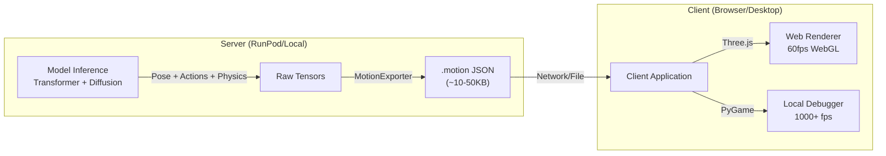

# High-Performance Rendering Pipeline

## Overview

Stick-Gen uses a **Decoupled Rendering Architecture**. Instead of baking video files on the server (which is slow and non-interactive), the model exports a lightweight Motion Schema (`.motion` JSON) that is rendered client-side.

This approach enables:
- **60+ FPS Rendering**: Using client GPU via WebGL/Three.js
- **Interactivity**: User can rotate, zoom, and scrub the timeline
- **Visual Fidelity**: Neon glows, bloom effects, shadows, and 3D environments
- **Low Bandwidth**: JSON files are ~100x smaller than MP4s

## Architecture



## Motion Schema (`.motion`)

The schema is a minified JSON object designed for efficient parsing.

### Structure
```json
{
  "meta": {
    "version": "1.0",
    "fps": 25,
    "total_frames": 250,
    "description": "A stick figure jumping"
  },
  "skeleton": {
    "type": "stick_figure_5_segment",
    "joints": ["Torso", "L_Leg", "R_Leg", "L_Arm", "R_Arm"]
  },
  "motion": [ ...flat float array... ],
  "actions": ["idle", "jump", "jump", ...]
}
```

### Data Layout
The `motion` array is a flattened float32 array.
- **Stride**: `input_dim` (default 20)
- **Indexing**: `frame_i = motion[i * stride : (i+1) * stride]`
- **Coordinates**: xy_lines format (x1, y1, x2, y2) per segment.

## Renderers

### Web (Three.js / React-Three-Fiber)
For the web frontend, use the `StickRefinery` component (external library) which consumes this schema.
- **Lighting**: UnrealBloomPass for neon aesthetics.
- **Geometry**: `LineSegments` or `MeshLine` for thick, glowing strokes.

### Local (PyGame)
For fast training debugging locally.
- **Path**: `src/vis/pygame_viewer.py` (Planned)
- **Performance**: >1000 FPS draw rate.

### Offline 2.5D Parallax (Training Augmentation)

For large-scale training, Stick-Gen can also render `.motion` sequences into depth-rich 2.5D stick-figure images using a headless Three.js renderer.

- **Python bridge**: `src/data_gen/parallax_augmentation.py`
- **Node renderer**: `src/data_gen/renderers/threejs_parallax_renderer.js`
- **CLI entrypoint**: `stick-gen generate-data --augment-parallax ...`

Example usage:

```bash
stick-gen generate-data \
  --config configs/medium.yaml \
  --augment-parallax \
  --views-per-motion 250 \
  --frames-per-view 4 \
  --output data/2.5d_parallax
```

Each canonical training sample is exported to `.motion`, then rendered into a directory of PNG frames organized by sample and actor index. For each `(sample, actor)` pair, the Node renderer also writes a small `metadata.json` sidecar that maps every PNG back to:

- `sample_id` / `actor_id`
- `view_id` (camera trajectory identifier within the motion)
- `view_index` and `step_index` within that trajectory
- motion frame index
- camera pose (position, target, FOV)

Parallax-specific configuration lives under the `data` section of the training configs (`configs/*.yaml`):

- `data.use_parallax_augmentation`: master switch for using parallax data
- `data.parallax_root`: root directory containing `sample_XXXXXX/actor_Y/` PNGs + metadata
- `data.parallax_image_size`: `[H, W]` resize for parallax images

The training-side loader for this data is `src/train/parallax_dataset.py::MultimodalParallaxDataset`, which exposes `(image_tensor, motion_frame_data, camera_pose, text_prompt, action_label)` for each rendered frame.

This enables downstream 2.5D-aware training pipelines to join image frames with their original text descriptions and action labels for multimodal supervision.
