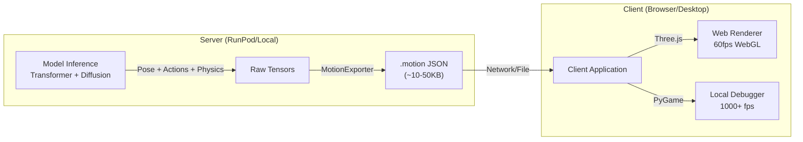

# High-Performance Rendering Pipeline

## Overview

Stick-Gen uses a **Decoupled Rendering Architecture**. Instead of baking video files on the server (which is slow and non-interactive), the model exports a lightweight Motion Schema (`.motion` JSON) that is rendered client-side.

This approach enables:
- **60+ FPS Rendering**: Using client GPU via WebGL/Three.js
- **Interactivity**: User can rotate, zoom, and scrub the timeline
- **Visual Fidelity**: Neon glows, bloom effects, shadows, and 3D environments
- **Low Bandwidth**: JSON files are ~100x smaller than MP4s

## Architecture



## Renderer Motion Schema (`.motion`, v1 export)

The **renderer/export schema** is a minified JSON object designed for efficient
parsing by the web and local debuggers. Canonical **training data** uses the v3
12-segment, 48-dimensional representation documented in
`docs/features/DATA_SCHEMA.md`; `.motion` files are derived from that
representation for visualization and deployment.

### Structure
```json
{
  "meta": {
    "version": "1.0",
    "fps": 25,
    "total_frames": 250,
    "description": "A stick figure jumping"
  },
  "skeleton": {
    "type": "stick_figure_5_segment",
    "segments": ["torso", "l_leg", "r_leg", "l_arm", "r_arm"]
  },
  "motion": [ ...flat float array... ],
  "actions": ["idle", "jump", "jump", ...]
}
```

### Data Layout
The `motion` array is a flattened float32 array.
- **Stride**: 20 values per frame (legacy v1 renderer schema).
- **Indexing**: `frame_i = motion[i * 20 : (i+1) * 20]`
- **Coordinates**: xy_lines format (x1, y1, x2, y2) per segment.

### Renderer Segment Format (v1, 5 segments)

The `.motion` **renderer/export schema** uses the following 5-segment ordering. Dataset
converters and training code operate on the richer **v3 canonical training
schema** (12 segments, 48-D); the exporter then maps from v3 to this v1 layout
when writing `.motion` files.

| Index | Segment | Connection | Description |
|-------|---------|------------|-------------|
| 0 | `torso` | neck → hip | Body trunk |
| 1 | `l_leg` | hip_center → left_foot | Left leg |
| 2 | `r_leg` | hip_center → right_foot | Right leg |
| 3 | `l_arm` | neck/shoulder → left_hand | Left arm |
| 4 | `r_arm` | neck/shoulder → right_hand | Right arm |

Each segment has 4 values: `[x1, y1, x2, y2]` where `(x1, y1)` is the start point
and `(x2, y2)` is the end point. Total: 5 segments × 4 coords = 20 values per
frame.

**Anatomical Attachment Points:**
- **Torso**: Connects neck (upper torso) to hip center (pelvis)
- **Legs**: Attach at hip center, extend to feet
- **Arms**: Attach at neck/shoulder center, extend to hands

This format is defined in `src/inference/exporter.py` and must be consistently
followed by all **renderers and `.motion` consumers**. Dataset converters and
training datasets use the v3 12-segment, 48-dimensional canonical schema on
disk, and the exporter projects from v3 to this export format when needed.

### Canonical v3 Training Schema (12 segments, 48D)

Training and dataset converters operate on the v3 schema before any `.motion`
export. The fixed segment ordering (see
`src/data_gen/joint_utils.py::V3_SEGMENT_NAMES`) is:

| Index | Segment        | Start joint    | End joint       |
|-------|----------------|----------------|-----------------|
| 0     | `head`         | `neck`         | `head_center`   |
| 1     | `upper_torso`  | `neck`         | `chest`         |
| 2     | `lower_torso`  | `chest`        | `pelvis_center` |
| 3     | `l_upper_arm`  | `l_shoulder`   | `l_elbow`       |
| 4     | `l_forearm`    | `l_elbow`      | `l_wrist`       |
| 5     | `r_upper_arm`  | `r_shoulder`   | `r_elbow`       |
| 6     | `r_forearm`    | `r_elbow`      | `r_wrist`       |
| 7     | `l_thigh`      | `l_hip`        | `l_knee`        |
| 8     | `l_shin`       | `l_knee`       | `l_ankle`       |
| 9     | `r_thigh`      | `r_hip`        | `r_knee`        |
| 10    | `r_shin`       | `r_knee`       | `r_ankle`       |
| 11    | `pelvis_width` | `l_hip`        | `r_hip`         |

Each segment is encoded as `[x1, y1, x2, y2]`, giving **48 values per frame**.
Connectivity constraints (shared joints between segments) are enforced by
`src/data_gen/joint_utils.validate_v3_connectivity`.

For quick visual inspection or documentation figures, use
`src/data_gen/renderer.py::Renderer.render_v3_sequence` to render a static
high-quality v3 stick-figure preview from `[T, 48]` motion.

## Renderers

### Web (Three.js / React-Three-Fiber)
For the web frontend, use the `StickRefinery` component (external library) which consumes this schema.
- **Lighting**: UnrealBloomPass for neon aesthetics.
- **Geometry**: `LineSegments` or `MeshLine` for thick, glowing strokes.

### Local (PyGame)
For fast training debugging locally.
- **Path**: `src/vis/pygame_viewer.py` (Planned)
- **Performance**: >1000 FPS draw rate.

### Offline 2.5D Parallax (Training Augmentation)

For large-scale training, Stick-Gen can also render `.motion` sequences into depth-rich 2.5D stick-figure images using a headless Three.js renderer.

- **Python bridge**: `src/data_gen/parallax_augmentation.py`
- **Node renderer**: `src/data_gen/renderers/threejs_parallax_renderer.js`
- **CLI entrypoint**: `stick-gen generate-data --augment-parallax ...`

Example usage:

```bash
stick-gen generate-data \
  --config configs/medium.yaml \
  --augment-parallax \
  --views-per-motion 250 \
  --frames-per-view 4 \
  --output data/2.5d_parallax
```

Each canonical training sample is exported to `.motion`, then rendered into a directory of PNG frames organized by sample and actor index. For each `(sample, actor)` pair, the Node renderer also writes a small `metadata.json` sidecar that maps every PNG back to:

- `sample_id` / `actor_id`
- `view_id` (camera trajectory identifier within the motion)
- `view_index` and `step_index` within that trajectory
- motion frame index
- camera pose (position, target, FOV)

Parallax-specific configuration lives under the `data` section of the training configs (`configs/*.yaml`):

- `data.use_parallax_augmentation`: master switch for using parallax data
- `data.parallax_root`: root directory containing `sample_XXXXXX/actor_Y/` PNGs + metadata
- `data.parallax_image_size`: `[H, W]` resize for parallax images

The training-side loader for this data is `src/train/parallax_dataset.py::MultimodalParallaxDataset`, which exposes `(image_tensor, motion_frame_data, camera_pose, text_prompt, action_label)` for each rendered frame.

This enables downstream 2.5D-aware training pipelines to join image frames with their original text descriptions and action labels for multimodal supervision.
