# Transformer Architecture

This document provides detailed technical documentation of the Transformer architecture used in stick-gen, following modern LLM best practices (Qwen/Llama standards).

## Architecture Overview

The stick-gen Transformer uses:

- **RMSNorm**: Root Mean Square normalization (no mean-centering, faster than LayerNorm)
- **SwiGLU**: Gated Linear Unit with Swish activation (3 projections: gate, value, output)
- **Pre-Norm**: `x = x + Block(Norm(x))` architecture for better training stability
- **RoPE**: Rotary Position Embeddings for relative position encoding

## Model Variants

> See [MODEL_SIZES.md](../MODEL_SIZES.md) for detailed parameter breakdowns.

| Variant | Motion-Only | Multimodal | d_model | Layers | Heads | Use Case |
|---------|-------------|------------|---------|--------|-------|----------|
| **Small** | 7.2M | 11.7M | 256 | 6 | 8 | CPU-friendly, edge devices |
| **Medium** | 20.6M | 25.1M | 384 | 8 | 12 | Recommended default |
| **Large** | 44.6M | 71.3M | 512 | 10 | 16 | Maximum quality |

## Transformer Layer (Pre-Norm + RMSNorm + RoPE + SwiGLU)

Each Transformer layer follows the Pre-Norm residual pattern:

```
x₁ = x₀ + Attention(RMSNorm(x₀))
x₂ = x₁ + SwiGLU(RMSNorm(x₁))
```

### Detailed Layer Diagram

```mermaid
flowchart LR
    X0["x₀ (d_model)"] --> N1["RMSNorm"]
    N1 --> ATT["Multi-Head Self-Attention<br/>+ RoPE(q, k)"]
    ATT --> ADD1["x₁ = x₀ + Attention(RMSNorm(x₀))"]
    ADD1 --> N2["RMSNorm"]
    N2 --> GATE["W_gate · x₁"]
    N2 --> VALUE["W_value · x₁"]
    GATE --> SILU["SiLU"]
    SILU --> MUL["⊙ (element-wise)"]
    VALUE --> MUL
    MUL --> PROJ_OUT["W_out · (...)"]
    PROJ_OUT --> ADD2["x₂ = x₁ + SwiGLU(RMSNorm(x₁))"]
```



### RMSNorm

RMSNorm normalizes by the root mean square of the input, without mean-centering:

```
RMSNorm(x) = x / sqrt(mean(x²) + ε) × γ
```

Where:
- `ε` is a small constant for numerical stability (default: 1e-6)
- `γ` is a learnable scale parameter initialized to 1

**Advantages over LayerNorm:**
- Faster computation (no mean subtraction)
- Empirically performs as well or better in Transformers

### SwiGLU Feed-Forward Network

SwiGLU uses a gating mechanism with three linear projections:

```mermaid
flowchart TB
    X["Input x<br/>(d_model)"] --> GATE["W_gate · x<br/>(d_ff)"]
    X --> VALUE["W_value · x<br/>(d_ff)"]
    GATE --> SILU["SiLU (Swish)"]
    SILU --> MUL["⊙ Element-wise Multiply"]
    VALUE --> MUL
    MUL --> OUT["W_out · (...)<br/>(d_model)"]
```



**Formula:**
```
SwiGLU(x) = (SiLU(x · W_gate) ⊙ (x · W_value)) · W_out
```

Where:
- `W_gate`: (d_model, d_ff) - Gate projection
- `W_value`: (d_model, d_ff) - Value projection
- `W_out`: (d_ff, d_model) - Output projection
- `d_ff = (8/3) × d_model` (following LLaMA convention)
- All projections have **no bias** (following modern practice)

**SiLU (Swish) Activation:**
```
SiLU(x) = x × sigmoid(x)
```

### RoPE (Rotary Position Embedding)

RoPE encodes position by rotating query and key vectors:

```mermaid
flowchart LR
    Q["Query q"] --> ROPE_Q["RoPE(q, pos)"]
    K["Key k"] --> ROPE_K["RoPE(k, pos)"]
    ROPE_Q --> ATT["Attention<br/>softmax(q·k^T / √d)"]
    ROPE_K --> ATT
```



RoPE applies position-dependent rotations to query and key pairs, enabling:
- Relative position encoding (attention depends on position difference)
- Extrapolation to longer sequences than seen during training
- No learned position embeddings required

## Multi-Head Self-Attention

The attention mechanism with RoPE:

```
Attention(Q, K, V) = softmax(RoPE(Q) · RoPE(K)^T / √d_k) · V
```

Each head operates on `d_model / num_heads` dimensions.

## Complete I/O Flow

```mermaid
flowchart LR
    subgraph INPUTS["Inputs"]
        P["🦴 Pose Sequence<br/>48-dim × T frames (v3 canonical)"]
        T["📝 Text Embedding<br/>1024-dim (BGE)"]
        A["🎬 Action Labels<br/>60 classes"]
        C["📷 Camera State<br/>(x, y, zoom)"]
    end

    subgraph TRANSFORMER["Transformer Core"]
        direction TB
        EMB["Input Embeddings"]
        LAYERS["N × Transformer Layers"]
        EMB --> LAYERS
    end

    subgraph OUTPUTS["Decoder Heads"]
        H1["🦴 Pose (48-dim)"]
        H2["📍 Position (2-dim)"]
        H3["⚡ Velocity (2-dim)"]
        H4["🏷️ Action (60 classes)"]
        H5["🔬 Physics (6-dim)"]
        H6["🌍 Environment (32-dim)"]
    end

    P --> TRANSFORMER
    T --> TRANSFORMER
    A --> TRANSFORMER
    C --> TRANSFORMER
    TRANSFORMER --> H1
    TRANSFORMER --> H2
    TRANSFORMER --> H3
    TRANSFORMER --> H4
    TRANSFORMER --> H5
    TRANSFORMER --> H6
```



## Implementation Reference

The implementation is in `src/model/transformer.py`:

- `RMSNorm` class (lines 9-65)
- `SwiGLU` class (lines 68-108)
- `RoPETransformerEncoderLayer` class (lines 197-256)
- `StickFigureTransformer` class (main model)

## References

- [RMSNorm Paper](https://arxiv.org/abs/1910.07467) - Zhang & Sennrich, 2019
- [SwiGLU Paper](https://arxiv.org/abs/2002.05202) - Shazeer, 2020
- [RoPE Paper](https://arxiv.org/abs/2104.09864) - Su et al., 2021
- [LLaMA](https://arxiv.org/abs/2302.13971) - Touvron et al., 2023
- [Qwen Technical Report](https://arxiv.org/abs/2309.16609) - Bai et al., 2023

