# Stick-Gen Model Release Pipeline: Complete Workflow Mapping

> **Version**: 1.0.0  
> **Last Updated**: December 2024  
> **Purpose**: Research publication transparency and reproducibility

This document provides a comprehensive workflow mapping for the Stick-Gen model release pipeline, covering all three model variants (small, medium, large) with their complete training stages (Pretrain → SFT → LoRA) using RunPod infrastructure.

---

## Table of Contents

1. [Executive Summary](#1-executive-summary)
2. [Model Architecture Specifications](#2-model-architecture-specifications)
3. [Multimodal Components](#3-multimodal-components)
4. [Data Pipeline](#4-data-pipeline)
5. [Data Artifacts and Storage Requirements](#5-data-artifacts-and-storage-requirements)
6. [Training Pipeline](#6-training-pipeline)
7. [RunPod Infrastructure](#7-runpod-infrastructure)
8. [Evaluation Framework](#8-evaluation-framework)
9. [Reproducibility Checklist](#9-reproducibility-checklist)
10. [StickGen-Bench Comparison Table](#10-stickgen-bench-comparison-table)
11. [Citations](#11-citations)

---

## Pipeline Overview Diagram

```mermaid
flowchart TB
    subgraph DATA["📊 Data Pipeline"]
        D1[("AMASS")] --> CONVERT
        D2[("HumanML3D")] --> CONVERT
        D3[("KIT-ML")] --> CONVERT
        D4[("NTU RGB+D")] --> CONVERT
        D5[("InterHuman")] --> CONVERT

        CONVERT["Convert to Canonical Format"] --> MERGE
        MERGE["Merge + Source Balancing"] --> CURATE
        CURATE["Quality Curation"] --> EMBED
        EMBED["Text Embeddings"] --> PRETRAIN_DATA & SFT_DATA

        PRETRAIN_DATA[("pretrain_data_embedded.pt")]
        SFT_DATA[("sft_data_embedded.pt")]
    end

    subgraph TRAIN["🏋️ Training Pipeline"]
        subgraph SMALL["Small 7.2M"]
            S_PRE["Pretrain"] --> S_SFT["SFT"] --> S_LORA["LoRA"]
        end
        subgraph MEDIUM["Medium 20.6M"]
            M_PRE["Pretrain"] --> M_SFT["SFT"] --> M_LORA["LoRA"]
        end
        subgraph LARGE["Large 44.6M"]
            L_PRE["Pretrain"] --> L_SFT["SFT"] --> L_LORA["LoRA"]
        end
    end

    subgraph EVAL["📈 Evaluation"]
        METRICS["FID, Diversity, R-Precision"]
        SAFETY["Safety Critic"]
        BENCH["StickGen-Bench"]
    end

    subgraph DEPLOY["🚀 Deployment"]
        RUNPOD["RunPod"] --> API["Inference API"]
        HF["HuggingFace"] --> API
    end

    PRETRAIN_DATA --> S_PRE & M_PRE & L_PRE
    SFT_DATA --> S_SFT & M_SFT & L_SFT
    S_LORA & M_LORA & L_LORA --> METRICS --> SAFETY --> BENCH --> RUNPOD & HF
```



---

## 1. Executive Summary

Stick-Gen is a transformer-based text-to-motion generation model that produces 2.5D stick-figure animations with physics-aware motion, expressive gestures, and camera-conditioned rendering. The model family consists of three variants optimized for different deployment scenarios:

| Variant | Motion-Only | Multimodal | Primary Use Case |
|---------|-------------|------------|------------------|
| **Small** | 7.2M | 11.7M | Edge devices, testing, budget deployments |
| **Medium** | 20.6M | 25.1M | **Recommended default**, balanced quality |
| **Large** | 44.6M | 71.3M | Maximum quality, production workloads |

### Key Innovations

1. **Physics-Aware Training**: Differentiable physics loss using velocity, acceleration, and momentum constraints
2. **2.5D Parallax Conditioning**: Multimodal image encoder for viewpoint-aware motion generation
3. **Curated Data Pipeline**: Quality-filtered training with source balancing and artifact detection
4. **Safety Critic**: Adversarial robustness evaluation and inference-time quality checks

---

## 2. Model Architecture Specifications

### 2.1 Transformer Architecture

All variants use a modern LLM-inspired architecture:

- **Normalization**: RMSNorm (Pre-Norm configuration)
- **Activation**: SwiGLU (Gated Linear Units)
- **Attention**: Multi-head attention with RoPE (Rotary Position Embeddings)
- **Text Embeddings**: BAAI/bge-large-en-v1.5 (1024-dim)

### 2.2 Variant Configurations

| Parameter | Small | Medium | Large |
|-----------|-------|--------|-------|
| `d_model` | 256 | 384 | 512 |
| `num_layers` | 6 | 8 | 10 |
| `nhead` | 8 | 12 | 16 |
| `embedding_dim` | 1024 | 1024 | 1024 |
| `dropout` | 0.1 | 0.1 | 0.1 |
| `num_actions` | 64 | 64 | 64 |
| `input_dim` | 20 | 20 | 20 |
| `output_dim` | 20 | 20 | 20 |

### 2.3 Component Parameter Breakdown

#### Small Variant (d=256, L=6, H=8)

| Component | Motion-Only | Multimodal |
|-----------|-------------|------------|
| Transformer Encoder | 6.3M | 6.3M |
| Text Projection | 656.6K | 656.6K |
| Image Encoder | - | 2.1M |
| Fusion Module | - | 2.4M |
| Decoder Heads | ~200K | ~200K |
| **Total** | **7.2M** | **11.7M** |

#### Medium Variant (d=384, L=8, H=12)

| Component | Motion-Only | Multimodal |
|-----------|-------------|------------|
| Transformer Encoder | 18.9M | 18.9M |
| Text Projection | 1.1M | 1.1M |
| Image Encoder | - | 2.1M |
| Fusion Module | - | 2.4M |
| Decoder Heads | ~475K | ~475K |
| **Total** | **20.6M** | **25.1M** |

#### Large Variant (d=512, L=10, H=16)

| Component | Motion-Only | Multimodal |
|-----------|-------------|------------|
| Transformer Encoder | 42.0M | 42.0M |
| Text Projection | 1.6M | 1.6M |
| Image Encoder (ResNet) | - | 11.7M |
| Fusion Module (Cross-Attn) | - | 15.0M |
| Decoder Heads | ~850K | ~850K |
| **Total** | **44.6M** | **71.3M** |

---

## 3. Multimodal Components

### 3.1 2.5D Parallax Conditioning

When `data.use_parallax_augmentation: true`, the model incorporates visual conditioning for viewpoint-aware motion generation:

```yaml
# Configuration in configs/*.yaml
data:
  use_parallax_augmentation: true
  parallax_root: "data/2.5d_parallax"
  parallax_image_size: [256, 256]
  image_backend: "pil"
```

### 3.2 Image Encoder Options

| Architecture | Parameters | Config Value | Recommended For |
|--------------|------------|--------------|-----------------|
| Lightweight CNN | ~2.1M | `lightweight_cnn` | Small/Medium models |
| ResNet | ~11.7M | `resnet` | Large model |
| Mini ViT | ~4-5M | `mini_vit` | Experimental |

### 3.3 Fusion Strategy Options

| Strategy | Parameters | Config Value | Description |
|----------|------------|--------------|-------------|
| Gated | ~2.4M | `gated` | Learned modality weights (**recommended**) |
| Concat | ~2.1M | `concat` | Simple concatenation + projection |
| FiLM | ~2.2M | `film` | Feature-wise Linear Modulation |
| Cross-Attention | ~15M | `cross_attention` | Most expressive (large model) |

### 3.4 Default Multimodal Configurations

| Variant | Image Encoder | Fusion Strategy | Multimodal Overhead |
|---------|---------------|-----------------|---------------------|
| Small | `lightweight_cnn` | `gated` | +4.5M |
| Medium | `lightweight_cnn` | `gated` | +4.5M |
| Large | `resnet` | `cross_attention` | +26.7M |

---

## 4. Data Pipeline

### 4.1 Source Datasets

| Dataset | Type | Role | Samples |
|---------|------|------|---------|
| **AMASS** | MoCap collection | Backbone of pretraining: diverse, physically plausible motion | ~5,592 sequences |
| **HumanML3D** | Text-motion pairs | High-quality text-motion alignment | ~14,616 sequences |
| **KIT-ML** | Text-motion pairs | Core semantic understanding | ~3,911 sequences |
| **NTU RGB+D** | Action recognition | Expands action vocabulary | ~56,880 sequences |
| **100STYLE** | Stylized motion | Style diversity (exaggerated, cinematic) | ~4,000 sequences |
| **InterHuman** | Multi-person | Interaction-heavy samples (talking, fighting) | ~6,022 sequences |
| **BABEL** | Action-labeled AMASS | Fine-grained action conditioning | ~13,220 sequences |
| **BEAT** | Body-expression-audio | Conversational gestures, emotional expression | ~76 hours |
| **Synthetic** | Auto-generated | Text diversity, rare combinations (max 40% SFT) | Configurable |

### 4.2 Canonical Data Format

All datasets are converted to a unified 20-dimensional motion representation:

```python
# Motion tensor: [T, 20] or [T, A, 20] for multi-actor
# 5 body segments × 4 coordinates (x1, y1, x2, y2)
# Segments: head, torso, left_arm, right_arm, legs

sample = {
    "motion": torch.Tensor,      # [T, D_motion] stick-figure poses
    "embedding": torch.Tensor,   # [1024] BAAI/bge-large-en-v1.5 text embedding
    "actions": torch.Tensor,     # [T] integer action labels (optional)
    "physics": torch.Tensor,     # [T, 6] physics features (optional)
    "camera": torch.Tensor,      # [T, 3] camera parameters (x, y, zoom)
}
```

### 4.3 Data Preparation Commands

```bash
# 1. Convert individual datasets
python -m scripts.convert_humanml3d --output data/humanml3d.pt
python -m scripts.convert_kit_ml --output data/kit_ml.pt
python -m src.data_gen.convert_amass --output data/amass.pt

# 2. Merge datasets with source balancing
python -m scripts.merge_datasets \
    --inputs data/humanml3d.pt data/kit_ml.pt data/amass.pt \
    --output data/merged_all.pt \
    --balance-sources --max-source-fraction 0.3 \
    --filter-artifacts --compute-stats

# 3. Curate into pretrain/SFT splits
python -m scripts.prepare_curated_datasets \
    --input data/merged_all.pt \
    --output-dir data/curated

# 4. Generate text embeddings
python -m scripts.build_dataset_for_training \
    --input data/curated/pretrain_data.pt \
    --output data/curated/pretrain_data_embedded.pt
```

### 4.4 Quality Thresholds

| Criterion | Pretraining | SFT |
|-----------|-------------|-----|
| Min Quality Score | 0.5 | 0.8 |
| Min Camera Stability | - | 0.6 |
| Max Artifact Score | 0.5 | 0.35 |
| Sequence Length | 25-500 frames | 25-500 frames |
| Max Source Fraction | 30% | 30% |
| Max Action Fraction | - | 30% |

---

## 5. Data Artifacts and Storage Requirements

This section documents all concrete data artifacts created by the Stick-Gen pipeline,
from raw motion sources through dataset conversion and rendering. For each artifact,
we record **location**, **format/shape**, **typical size**, and **retention policy** to
enable accurate storage planning and full reproducibility.

### 5.1 Raw Data Generation Stage

Raw data refers to the **original datasets as distributed by their authors** plus any
downloaded annotation files. Paths are dataset-specific and typically live under a
configurable `DATA_ROOT` outside this repository.

| Artifact Type | Examples / File Types | Typical Location Pattern | Size Estimate | Retention |
|---------------|------------------------|---------------------------|---------------|-----------|
| Raw MoCap / skeleton sequences | AMASS (`.npz`, `.pkl`), NTU RGB+D (`.npy`), InterHuman (`.pkl`, `.npz`) | `$DATA_ROOT/<dataset_name>/raw/` (dataset-native layout) | 50–500 KB / 10s clip; 50–200 GB total across all datasets | **Kept** (read-only source of truth; required to regenerate canonical `.pt` files) |
| Raw text / annotation files | HumanML3D, KIT-ML, BABEL, BEAT JSON/CSV annotations | `$DATA_ROOT/<dataset_name>/(annotations|texts)/` | 1–10 KB / sample; a few GB total | **Kept** (needed for re-building text-motion pairs) |
| Upstream metadata | License files, README, dataset stats | `$DATA_ROOT/<dataset_name>/*` | Negligible | **Kept** (documentation) |

> Note: The pipeline **does not modify** raw data in-place. All processing happens on
> derived `.pt` artifacts under `data/`, which are documented below.

### 5.2 Dataset Conversion & Curation Stage

After download, all datasets are converted into a canonical torch format and merged
into curated training splits.

#### 5.2.1 Canonical per-dataset artifacts

| Artifact | Path / Pattern | Format / Shape | Typical Size | Retention |
|----------|----------------|----------------|--------------|-----------|
| Canonical motion dataset | `data/motions_processed/<dataset>/canonical.pt` | `torch.save(list[dict])`, each sample with fields like `motion: [T, 20]`, `embedding: [1024]`, `actions`, `physics`, `camera` | 2–20 GB per dataset (depending on length) | **Recommended to keep** while iterating; can be regenerated from raw data |

#### 5.2.2 Merged & curated splits

| Artifact | Path | Format / Shape | Typical Size | Retention |
|----------|------|----------------|--------------|-----------|
| Merged dataset | `data/merged_all.pt` | `torch.save(list[dict])` of all sources, same schema as canonical datasets | 10–40 GB | **Optional** once curated splits exist; can be re-created via `merge_datasets.py` |
| Merge statistics | `data/merged_all.stats.json` | JSON with source/action histograms, quality stats | <10 MB | **Kept** for reporting & debugging |
| Curated pretrain split | `data/curated/pretrain_data.pt` | `torch.save(list[dict])`, filtered by pretrain thresholds | 5–25 GB | **Recommended to keep** while experimenting; can be recomputed from merged_all.pt & raw stats |
| Curated SFT split | `data/curated/sft_data.pt` | Same structure as pretrain split | 5–15 GB | **Recommended to keep** |
| Curation report | `data/curated/curation_stats.json` | JSON summary: dropped samples, artifact rates, source/action distribution | <10 MB | **Kept** for reproducibility and paper reporting |

#### 5.2.3 Embedded training datasets (final model inputs)

| Artifact | Path | Format / Shape | Typical Size | Retention |
|----------|------|----------------|--------------|-----------|
| Embedded pretrain dataset | `data/curated/pretrain_data_embedded.pt` | `torch.save(list[dict])` with `motion: [T, 20]`, `embedding: [1024]` and optional metadata; number of samples ≈ pretrain_data.pt | 10–40 GB depending on corpus | **Critical**: primary input to pretraining; should be **kept** for all reproduced runs |
| Embedded SFT dataset | `data/curated/sft_data_embedded.pt` | Same structure as pretrain embedded, but higher quality & smaller | 5–20 GB | **Critical**: input for SFT & LoRA; should be **kept** |

> Storage note: On a typical full-scale setup, expect **30–80 GB** for embedded
> training datasets alone, plus ~20–60 GB for intermediate merged/curated artifacts.

### 5.3 Rendering & Visualization Stage

Rendering artifacts are produced both for **offline training augmentation** (2.5D
parallax) and **human-facing visualization** (web viewer `.motion` files, debug
videos).

#### 5.3.1 Three.js-compatible motion JSON

Generated by `src/inference/exporter.py::MotionExporter` and consumed by the web
viewer / React-Three-Fiber frontend.

| Artifact | Path / Pattern | Format / Shape | Typical Size | Retention |
|----------|----------------|----------------|--------------|-----------|
| Motion JSON schema | `exports/motion/<run_id>/<sample_id>.motion` (recommended) | Minified JSON with `meta`, `skeleton`, and flattened `motion` array `[T * 20]`; optional `physics` & `camera` arrays | 50–200 KB per 10s clip | **Kept** for demos, evaluation, and publication artifacts |

#### 5.3.2 2.5D parallax PNG frame sequences

Produced by `src/data_gen/parallax_augmentation.py` +
`src/data_gen/renderers/threejs_parallax_renderer.js`.

| Artifact | Path / Pattern | Format / Shape | Typical Size | Retention |
|----------|----------------|----------------|--------------|-----------|
| Temporary motion exports | `<output_dir>/_motion_tmp/sampleXXXXXX_actorY.motion` | `.motion` JSON exported per actor from canonical dataset | ~50–150 KB each | **Discardable** after PNGs are generated |
| Parallax PNG frames | `<output_dir>/sample_XXXXXX/actor_Y/view_00000.png` or `view_00000_f000.png` (for `frames_per_view>1`) | 8-bit RGBA PNG, default `512×512` pixels; one per view or frame | 200–800 KB per frame; tens to hundreds of GB for large runs | **Optional** after training; can be regenerated if canonical datasets are kept |
| Parallax metadata | `<output_dir>/sample_XXXXXX/actor_Y/metadata.json` | JSON listing frames, per-frame camera parameters, FPS, and view indices | <1 MB per sample/actor | **Recommended** to keep if parallax data is part of reported experiments |

#### 5.3.3 Debug / evaluation videos (MP4)

Generated via `src/data_gen/renderer.py::Renderer.render_scene` and
`Renderer.render_raw_frames`, heavily used in tests under `tests/outputs/`.

| Artifact | Path / Pattern | Format / Shape | Typical Size | Retention |
|----------|----------------|----------------|--------------|-----------|
| Test/debug videos | `tests/outputs/test_*.mp4` | H.264 MP4, 25 FPS, typical resolutions `640×480` or `960×480` | 20–300 KB per short test clip | **Discardable**, but kept in CI and dev to verify regression-free rendering |
| Evaluation videos | `outputs/videos/<run_id>/*.mp4` (recommended) | Same as above, typically longer duration (10–30s) | 1–10 MB per clip | Optional; useful for qualitative evaluation and paper figures |

> Storage note: If you enable large-scale parallax augmentation (thousands of
> views per motion) plus debug videos, **rendering artifacts can dominate disk
> usage**. Plan for an additional **100+ GB** if storing all PNG frames.

### 5.4 Consolidated Artifact Matrix

Quick reference matrix covering all artifacts from Sections 5.1–5.3.

| Stage | Artifact | Path Pattern | Format | Typical Size | Retention |
|-------|----------|--------------|--------|--------------|-----------|
| Raw Data | Raw MoCap / skeleton sequences | `$DATA_ROOT/<dataset>/raw/*` | Dataset-native (NPZ/PKL/NPY, etc.) | 50–500 KB per 10s clip; 50–200 GB total across all datasets | **Critical** (source of truth for all downstream artifacts) |
| Raw Data | Text / label annotations | `$DATA_ROOT/<dataset>/(annotations|texts)/*` | JSON / CSV / TXT | 1–10 KB per sample; a few GB total | **Critical** (needed to rebuild text–motion pairs) |
| Raw Data | Upstream metadata & licenses | `$DATA_ROOT/<dataset>/*` | Text / Markdown / PDF | Negligible | **Recommended** (documentation & licensing) |
| Conversion | Canonical per-dataset motion | `data/motions_processed/<dataset>/canonical.pt` | `torch.save(list[dict])` | 2–20 GB per dataset | **Recommended** (speeds up re-curation; regenerable from raw) |
| Conversion | Merged dataset | `data/merged_all.pt` | `torch.save(list[dict])` | 10–40 GB | **Optional** (rebuild via merge script) |
| Conversion | Merge statistics | `data/merged_all.stats.json` | JSON | <10 MB | **Recommended** (for analysis & reporting) |
| Curation | Curated pretrain split | `data/curated/pretrain_data.pt` | `torch.save(list[dict])` | 5–25 GB | **Recommended** (input to embedding; recomputable) |
| Curation | Curated SFT split | `data/curated/sft_data.pt` | `torch.save(list[dict])` | 5–15 GB | **Recommended** (input to embedding; recomputable) |
| Curation | Curation report | `data/curated/curation_stats.json` | JSON | <10 MB | **Recommended** (documents filtering & quality thresholds) |
| Embedding | Embedded pretrain dataset | `data/curated/pretrain_data_embedded.pt` | `torch.save(list[dict])` | 10–40 GB | **Critical** (primary pretraining input for reproducibility) |
| Embedding | Embedded SFT dataset | `data/curated/sft_data_embedded.pt` | `torch.save(list[dict])` | 5–20 GB | **Critical** (primary SFT / LoRA input) |
| Rendering | Web viewer motion exports | `exports/motion/<run_id>/<sample_id>.motion` | JSON (`.motion` schema) | 50–200 KB per 10s clip | **Recommended** (demos, qualitative eval, paper figures) |
| Rendering | Temporary parallax motion exports | `<output_dir>/_motion_tmp/sampleXXXXXX_actorY.motion` | JSON (`.motion` per actor) | ~50–150 KB each | **Discardable** (only needed during parallax generation) |
| Rendering | Parallax PNG frames | `<output_dir>/sample_XXXXXX/actor_Y/view_*.png` | PNG (8-bit RGBA, e.g., 512×512) | 200–800 KB per frame; up to 100+ GB for large runs | **Optional** (rebuildable; may be archived for key runs) |
| Rendering | Parallax metadata | `<output_dir>/sample_XXXXXX/actor_Y/metadata.json` | JSON | <1 MB per sample/actor | **Recommended** (describes views/cameras for parallax experiments) |
| Rendering | Test/debug videos | `tests/outputs/test_*.mp4` | MP4 (H.264, 25 FPS) | 20–300 KB per test clip | **Discardable** (CI/dev artifacts; regenerated on demand) |
| Rendering | Evaluation / demo videos | `outputs/videos/<run_id>/*.mp4` | MP4 (H.264, 25 FPS) | 1–10 MB per clip | **Optional** (qualitative evaluation & communication) |

---

## 6. Training Pipeline

### 6.1 Training Stages Overview

| Stage | Purpose | Data | Epochs | Learning Rate |
|-------|---------|------|--------|---------------|
| **Pretraining** | Foundation model | pretrain_data_embedded.pt | 30-100 | 3e-4 |
| **SFT** | Quality refinement | sft_data_embedded.pt | 15-25 | 1e-4 to 5e-5 |
| **LoRA** | Efficient adaptation | Domain-specific | 15-25 | 1e-4 |

### 6.2 Hyperparameter Tables

#### Pretraining Configuration

| Parameter | Small | Medium | Large |
|-----------|-------|--------|-------|
| Config File | `configs/small.yaml` | `configs/medium.yaml` | `configs/large.yaml` |
| Batch Size | 1 | 2 | 4 |
| Grad Accum Steps | 16 | 32 | 64 |
| Effective Batch | 16 | 64 | 256 |
| Epochs | 30 | 50 | 100 |
| Learning Rate | 3e-4 | 3e-4 | 3e-4 |
| Warmup Epochs | 5 | 10 | 15 |
| Weight Decay | 0.01 | 0.01 | 0.01 |

#### SFT Configuration

| Parameter | Small | Medium | Large |
|-----------|-------|--------|-------|
| Config File | `configs/sft_small.yaml` | `configs/sft_medium.yaml` | `configs/sft_large.yaml` |
| Epochs | 15 | 20 | 25 |
| Learning Rate | 1e-4 | 1e-4 | 5e-5 |
| Warmup Epochs | 2 | 3 | 5 |

#### LoRA Configuration

| Parameter | Small | Medium | Large |
|-----------|-------|--------|-------|
| Rank | 8 | 8 | 16 |
| Alpha | 16 | 16 | 32 |
| Dropout | 0.05 | 0.05 | 0.05 |
| Target Modules | `transformer_encoder`, `pose_decoder` | Same | Same |
| Trainable Params | ~0.5M | ~1.2M | ~3.5M |

### 6.3 Loss Function Weights

| Loss Component | Pretraining | SFT |
|----------------|-------------|-----|
| Pose Reconstruction | 1.0 | 1.0 |
| Temporal Smoothness | 0.1 | 0.1 |
| Action Prediction | 0.15 | 0.2 |
| Physics Consistency | 0.2 | 0.25 |
| Diffusion Refinement | 0.1 | 0.1 |

### 6.4 Training Commands

```bash
# Pretraining
python -m src.train.train \
  --config configs/medium.yaml \
  --data_path data/curated/pretrain_data_embedded.pt \
  --checkpoint_dir outputs/ckpts_medium_pretrain

# SFT (warm-start from pretrained)
python -m src.train.train \
  --config configs/sft_medium.yaml \
  --data_path data/curated/sft_data_embedded.pt \
  --checkpoint_dir outputs/ckpts_medium_sft \
  --init_from outputs/ckpts_medium_pretrain/model_checkpoint_best.pth

# LoRA Fine-tuning (set lora.enabled: true in config)
python -m src.train.train \
  --config configs/sft_medium.yaml \
  --data_path data/curated/sft_data_embedded.pt \
  --checkpoint_dir outputs/ckpts_medium_lora \
  --init_from outputs/ckpts_medium_sft/model_checkpoint_best.pth
```

---

## 7. RunPod Infrastructure

### 7.1 Hardware Requirements

| Variant | Recommended GPU | VRAM | Training Time (Pretrain) |
|---------|-----------------|------|--------------------------|
| Small | RTX A4000 / RTX 3060 | 16GB | ~12 hours |
| Medium | RTX A5000 / RTX 3090 | 24GB | ~50 hours |
| Large | A100 PCIe | 40-80GB | ~100 hours |

### 7.2 Cost Estimates (December 2024)

| Stage | Small | Medium | Large |
|-------|-------|--------|-------|
| Data Preparation | $1.50 | $1.50 | $1.50 |
| Pretraining | $3.00 | $17.50 | $100.00 |
| SFT | $2.00 | $5.25 | $30.00 |
| LoRA | $1.25 | $2.80 | $15.00 |
| **Total per Variant** | **$7.75** | **$27.05** | **$146.50** |

**Storage**: 200GB Network Volume = $20-40/month
**Full Pipeline (All 9 Models)**: ~$218

### 7.3 RunPod Deployment Commands

```bash
# 1. Create Network Volume (200GB recommended)
./runpod/deploy.sh create-volume --volume-size 200 --datacenter EU-CZ-1

# 2. Upload Data to Volume
./runpod/deploy.sh upload-data --volume-id <VOLUME_ID>

# 3. Run Data Preparation (curated pipeline)
./runpod/deploy.sh prep-data --volume-id <VOLUME_ID> --curated

# 4. Train Individual Variant
./runpod/deploy.sh train-base --volume-id <VOLUME_ID> --variant medium

# 5. Train All Variants (automated)
./runpod/deploy.sh auto-train-all --volume-id <VOLUME_ID> --curated
```

---

## 8. Evaluation Framework

### 8.1 Evaluation Metrics

| Metric | Description | Implementation |
|--------|-------------|----------------|
| **FID (Motion)** | Fréchet distance between generated and real motion distributions | `src/eval/metrics.py::compute_frechet_distance()` |
| **Diversity** | Variance in generated motions for same prompt | `src/eval/metrics.py::compute_motion_diversity()` |
| **Realism Score** | Combined smoothness, artifact, velocity score [0-1] | `src/eval/metrics.py::compute_motion_realism_score()` |
| **Artifact Score** | Detection of jitter, static, explosions, repetition | `src/eval/metrics.py::compute_synthetic_artifact_score()` |
| **Physics Consistency** | Velocity/acceleration within plausible bounds | `src/eval/metrics.py::compute_physics_consistency_metrics()` |
| **Text Alignment** | Cosine similarity between text and motion embeddings | `src/eval/metrics.py::compute_text_alignment_from_embeddings()` |

### 8.2 Artifact Detection Thresholds

| Artifact Type | Detection Method | Threshold |
|---------------|------------------|-----------|
| Jitter | Acceleration variance / mean velocity | > 0.3 |
| Static Poses | Frames with velocity < 0.01 | > 80% of frames |
| Explosions | Z-score of velocity > 3.0 | Any occurrence |
| Repetition | Autocorrelation at lags 5-20 | > 0.7 |

### 8.3 Safety Critic Checks

| Check | Description | Severity |
|-------|-------------|----------|
| Frozen Motion | Near-zero velocity for >80% frames | 0.9 (Critical) |
| Repetitive Motion | ≥3 similar cyclic windows | 0.7 (High) |
| Jittery Motion | High acceleration in >30% frames | 0.6 (Medium) |
| Velocity Exceeded | Physics velocity > 15 m/s | 0.8 (High) |
| Ground Penetration | Body parts below y = -0.1 | 0.6 (Medium) |

### 8.4 Evaluation Commands

```bash
# Run comprehensive evaluation
python scripts/run_comprehensive_eval.py \
    --checkpoint checkpoints/best_model.pth \
    --output_dir eval_results/

# Run adversarial evaluation
python scripts/run_adversarial_eval.py \
    --checkpoint checkpoints/best_model.pth \
    --suites adversarial_contradictory adversarial_extreme_actions

# Compute FID against reference dataset
python scripts/evaluate.py \
    --checkpoint checkpoints/best_model.pth \
    --reference_data data/humanml3d.pt \
    --num_samples 1000
```

---

## 9. Reproducibility Checklist

### 9.1 Environment Setup

```bash
# Clone repository
git clone https://github.com/gestura-ai/stick-gen.git
cd stick-gen

# Create virtual environment
python -m venv venv
source venv/bin/activate

# Install dependencies
pip install -r requirements.txt

# Verify installation
python -c "import torch; print(torch.__version__)"
python scripts/verify_model_params.py
```

### 9.2 Data Preparation Checklist

- [ ] Download AMASS dataset from https://amass.is.tue.mpg.de/
- [ ] Download HumanML3D from https://github.com/EricGuo5513/HumanML3D
- [ ] Download KIT-ML from https://motion-annotation.humanoids.kit.edu/
- [ ] Run dataset conversion scripts
- [ ] Run merge_datasets.py with source balancing
- [ ] Run prepare_curated_datasets.py
- [ ] Run build_dataset_for_training.py for embeddings
- [ ] Verify output files exist:
  - `data/curated/pretrain_data_embedded.pt`
  - `data/curated/sft_data_embedded.pt`

### 9.3 Training Checklist

- [ ] Verify GPU availability: `nvidia-smi`
- [ ] Set environment variables (RUNPOD_API_KEY if using RunPod)
- [ ] Run pretraining with appropriate config
- [ ] Verify checkpoint saved: `checkpoints/model_checkpoint_best.pth`
- [ ] Run SFT with `--init_from` pointing to pretrained checkpoint
- [ ] Run LoRA training (optional)
- [ ] Run evaluation on held-out test set

### 9.4 Evaluation Checklist

- [ ] Run `scripts/run_comprehensive_eval.py`
- [ ] Verify FID score is within expected range
- [ ] Run adversarial evaluation
- [ ] Check robustness gap < 30%
- [ ] Generate comparison table for paper

---

## 10. StickGen-Bench Comparison Table

### 10.1 Benchmark Protocol

**Evaluation Datasets:**
- HumanML3D test split (4,384 samples)
- KIT-ML test split (1,000 samples)
- AMASS held-out subset (500 samples)

**Metrics:**
- FID↓ (lower is better)
- Diversity↑ (higher is better)
- R-Precision↑ (Top-3 retrieval accuracy)
- Multimodality↑ (variance across generations)

### 10.2 Comparison Table Template

| Model | Params | FID↓ | Diversity↑ | R-Precision↑ | Multimodality↑ |
|-------|--------|------|------------|--------------|----------------|
| MDM | 22M | 0.544 | 9.559 | 0.611 | 2.799 |
| MotionDiffuse | 78M | 0.630 | 9.410 | 0.782 | 1.553 |
| T2M | 24M | 1.067 | 9.188 | 0.740 | 2.052 |
| MLD | 20M | 0.473 | 9.724 | 0.772 | 2.413 |
| **Stick-Gen Small** | 7.2M | TBD | TBD | TBD | TBD |
| **Stick-Gen Medium** | 20.6M | TBD | TBD | TBD | TBD |
| **Stick-Gen Large** | 44.6M | TBD | TBD | TBD | TBD |

### 10.3 Unique Advantages

| Feature | Stick-Gen | MDM | MotionDiffuse | T2M |
|---------|-----------|-----|---------------|-----|
| Physics-Aware Training | ✅ | ❌ | ❌ | ❌ |
| 2.5D Parallax Conditioning | ✅ | ❌ | ❌ | ❌ |
| Expressive Face/Hands | ✅ | ❌ | ❌ | ❌ |
| Multi-Actor Support | ✅ | ❌ | ❌ | ❌ |
| Camera Motion Control | ✅ | ❌ | ❌ | ❌ |
| LoRA Fine-tuning | ✅ | ❌ | ❌ | ❌ |
| Safety Critic | ✅ | ❌ | ❌ | ❌ |

---

## 11. Citations

Please cite the following when using Stick-Gen:

```bibtex
@software{stickgen2024,
  title = {Stick-Gen: Physics-Aware Text-to-Motion Generation with 2.5D Parallax Conditioning},
  author = {Gestura AI},
  year = {2024},
  url = {https://github.com/gestura-ai/stick-gen}
}
```

For dataset citations, see [CITATIONS.md](../../CITATIONS.md).

---

*Document generated for research publication transparency. Last updated: December 2024.*
